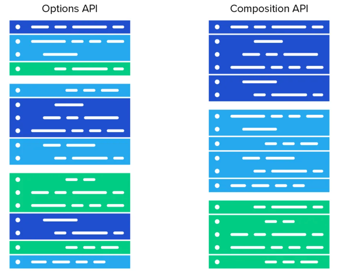

# Code Conventions Vue Js
Приведенные ниже правила нужны для соблюдения консистентности кода. Соблюдение этих правил приветствуется.


## Общие
1. Все папки должны быть названы в `camelCase`
```
👎
components/
|- main-header ...
|- LeadComponent ...
|- projects_section ...

👍
components/
|- mainHeader ...
|- leadComponent ...
|- projectsSection ...
```
2. Изображения
* Все изображения должны быть описательными и в `kebab-case`.
* Структура названия: `название-модификатор.расширение`
* **Все изображение должны быть форматированы в `.webp`**
```
👎
images/
|- photoOfficeXl.webp
|- bgWhite.jpg
|- bg_black.webp
|- ValuablePhoto375.png

👍
images/
|- photo-office-xl.webp
|- background-main-white.webp
|- background-main-black.webp
|- valuable-photo-375.webp
```
3. Иконки
* Названия иконок должны быть описательными, в `camelCase` и оканчиваться на 'Icon'
* Структура названия: `названиеIcon.svg`
```
👎
icons/
|- icon-telegram.svg
|- bnmap_logo_icon.svg
|- background.svg

👍
icons/
|- iconTelegramIcon.svg
|- bnmapLogoIcon.svg
|- dottedBackgroundIcon.svg
```

## JavaScript
1. Размер отступа должен быть равен двум символам;
2. Не следует опускать скобки и писать без перехода на новую строку функции, циклы, классы и др.
``` Javascript 
// 👎
if(condition) doSomething();
while(condition) iterating++;
for(var i=0;i<100;i++) someIterativeFunction();
   
// 👍
if ( condition ) {
  ...
}
while ( condition ) {
  ...
}
for ( var i = 0; i < 100; i++ ) {
  ...
}
```
3. Кавычки должны быть одинарными `'`
``` Javascript 
let variable = 'hello'
```
4. Условные проверки:
``` Javascript
// При проверке длины массивы
// 👎
if ( array.length > 0 ) ...
// 👍
if ( array.length ) ...

// При проверке массива на пустоту
// 👎
if ( array.length === 0 ) ...
// 👍
if ( !array.length ) ...

// При проверке на не пустую строку
// 👎
if ( string !== "" ) ...
// 👍
if ( string ) ...

// При проверке пустой строки
// 👎
if ( string === "" ) ...
// 👍
if ( !string ) ...

Аналогично:
// 👎
if ( foo === true ) ...
// 👍
if ( foo ) ...

// 👎
if ( foo === false ) ...
// 👍
if ( !foo ) ...

// Однако если нужна проверка только на `Boolean` значение то использовать:
if ( foo === false ) ...
```
* Следует избегать лишних приведений к типу `Boolean`
``` Javascript
// 👎
const result = true
if (!!result) {
  ...
}

// 👍
const result = true
if (result) {
  ...
}
```
5. Названия переменнных, функций, параметров и др.
* Все переменные, функции и параметры должны быть именованы в `camelCase`
``` Javascript 
// 👎
let SomeVariable
let some_variable

// 👍
let someVariable
```
* Все переменные, функции, параметры, и классы должны иметь осмысленное название, которое отражает суть названной сущности
``` Javascript
// 👎
function getFromLS(value) ...
// 👍
function getItemFromLocalStorage(itemKey) ...

// 👎
let r = 'Moscow'
// 👍
let region = 'Moscow'
```
* Для дефолтных переменных следует использовать `CONSTANT_CASE`(`upper snake case`)
``` Javascript
const DEFAULT_REGION = 'Moscow'
```
6. Всегда использовать ранний `return`, это улучшает читаемость и скорость выполнения кода
``` Javascript
// 👎
function returnLate(foo) {
var ret;

if ( foo ) {
  ret = "foo";
  } else {
  ret = "quux";
}

  return ret;
}

// 👍
function returnEarly(foo) {
  if ( foo ) {
  return "foo";
  }
  
  return "quux";
}
```
7.  Перед последним `return` всегда долженр быть отступ
``` Javascript
// 👎
function someFucntion() { 
  const someVariable = 'hello'
  return someVariable
}
// 👍
function someFucntion() { 
  const someVariable = 'hello'
  
  return someVariable
}
```

8. Всегда использовать `===` вместо `==` для сраввнения
``` Javascript
// 👎
if (variable == 'hello') ...

// 👍
if (variable === 'hello') ...
```

9. При наличии у функции более двух параметров передавать их как объект
``` Javascript
// 👎
function manyParametersFunction(name, phone, address) { ... }

manyParametersFunction('Viktor', '+79993334444', 'Moscow')

// 👍
function manyParametersFunction({ name, phone, address }) { ... }

manyParametersFunction({ name: 'Viktor', phone: '+79993334444', address: 'Moscow' })
```
10. Коментарии
* Количество комментариев необходимо свести к минимуму за счет построения понятной структуры кода и грамотного именования сущностей
* При комментировании костылей необходимо выделять их в отдельный блок и добавлять отступы до и после блока
``` Javascript 
someFunction()

// Костыль. <Причина появления костыля>
someClutchFunction();
// ----

someFunction()
```
11. Конкантенация строк
``` Javascript
// 👎
let someString = someString1 + ' ' + someString2

// 👍
let someString = `${someString1} ${someString2}`
```
12. Выбрасывать (`throw`) только объект `Error`
``` Javascript
// 👎
throw 'error'

// 👍
throw new Error('error')
```
13. Не использовать тернарный опетор при наличии более простой альтернативы
``` Javascript
// 👎
let score = val ? val : 0

// 👍
let score = val || 0
```
14. Документация `JSDoc` строго на английском языке. Это связано с тем, что английский более строгий язык и допускает меньше двойных трактований
``` Javascript
// 👎
/**
 * Возвращает сумму двух чисел
 * ...
 */
function add(x, y) {
  return x + y;
}

// 👍
/**
 * Returns sum of two numbers
 * ...
 */
function add(x, y) {
  return x + y;
}
```

15. Использовать `@typedef` в `JSDoc` для повторяющихся типов
``` Javascript
// 👎
/**
 * @param {Object} user
 * @param {string} user.name
 * @param {number} user.age
 */
function greetUser({ name, age }) {
  console.log(`Привет, ${user.name}!`);
}

/**
 * @param {Object} employee
 * @param {string} employee.name
 * @param {number} employee.age
 */
function hireEmployee({ name, age }) {
  console.log(`${employee.name} принят на работу.`);
}

// 👍
/**
 * @typedef {Object} Person
 * @property {string} name
 * @property {number} age
 */

/**
 * @param {Person} user
 */
function greetUser({ name, age }) {
  console.log(`Привет, ${user.name}!`);
}

/**
 * @param {Person} employee
 */
function hireEmployee({ name, age }) {
  console.log(`${employee.name} принят на работу.`);
}

```
16. При использование `JSDoc` не следует добавлять отступ после описания
``` Javascript
// 👎
/**
 * Returns sum of two numbers
 *
 * @param {number} x
 * ...
 */
function add(x, y) {
  return x + y;
}

// 👍
/**
 * Returns sum of two numbers
 * @param {number} x
 * ...
 */
function add(x, y) {
  return x + y;
}
```


## TypeScript
1. `Type` следует использовать только для простых типов, во всех остальных случаях следует использовать `interface`
```javascript
// 👎
interface SimpleType {
  value: number | string;
}

// 👍
type SimpleType = number | string;

// 👎
type ComplexObject = {
  id: number;
  name: string;
  data: any[];
};

// 👍
interface ComplexObject {
  id: number;
  name: string;
  data: any[];
}
```

2. Используя `typescript` не следует типизировать код с помощью `JSDoc`
``` javascript
// 👎
/**
 * Returns sum of two numbers
 * @param {number} x
 * @param {number} y
 * @returns {number}
 */
function add(x: number, y: number): number {
  return x + y;
}

// 👍
/**
 * Returns sum of two numbers
 */
function add(x: number, y: number): number {
  return x + y;
}

```


## Vue
1. Название компонентов
* Названия компонентов всегда в `PascalCase`
```
👎
components/
|- myComponent.vue

👍
components/
|- MyComponent.vue
```
* Названия компонентов должны содержать более одного слова. Сокращения не допускаются
``` Vue
// 👎
<Lead />

// 👍
<LeadBanner />
```
* Названия базовых компонентов начинаются с **Base**
```
👎
components/
|- MyButton.vue
|- VueTable.vue
|- Icon.vue

👍
components/
|- BaseButton.vue
|- BaseTable.vue
|- BaseIcon.vue
```
* Тесно связанные компоненты должны содержать название компонента родителя 
```
👎
components/
|- TodoList.vue
|- TodoItem.vue
|- TodoButton.vue

components/
|- SearchSidebar.vue
|- NavigationForSearchSidebar.vue

👍
components/
|- TodoList.vue
|- TodoListItem.vue
|- TodoListItemButton.vue

components/
|- SearchSidebar.vue
|- SearchSidebarNavigation.vue
```
* Порядок слов в названиях компонентов от высших (наиболее общих) к низшим (модификаторам)
```
👎
components/
|- ClearSearchButton.vue
|- ExcludeFromSearchInput.vue
|- LaunchOnStartupCheckbox.vue
|- RunSearchButton.vue
|- SearchInput.vue
|- TermsCheckbox.vue

👍
components/
|- SearchButtonClear.vue
|- SearchButtonRun.vue
|- SearchInputQuery.vue
|- SearchInputExcludeGlob.vue
|- SettingsCheckboxTerms.vue
|- SettingsCheckboxLaunchOnStartup.vue
```
* Кастомные компоненты в `<template>` должны быть в `PascalCase`. Сторонние компоненты в `kebab-case` 
``` Vue
// 👎
<BaseButton />
<NSidebar />

// 👍
<BaseButton />
<n-sidebar />
```
2. Пропсы 
* Названия пропсов в `<template>` всегда в `kebab-case`, в `<script>` — `camelCase`
``` Vue
// 👍
<template>
  <ChildComponent :title-tag='h1' />
</template>

<script>
const props = defineProps({
  titleTag: String
})
</script>
```
* Детализированное описание пропсов используется всегда
``` Javascript
// 👎, разрешается только при прототипировании
const props = defineProps(['status'])

// 👍
const props = defineProps({
  status: {
    type: String,
    required: true,
  }
})
```
3. Простые выражение в `<template>`
``` Javascript
// 👎
{{
  fullName.split(' ').map((word) => {
    return word[0].toUpperCase() + word.slice(1)
  }).join(' ')
}}

// 👍
{{ normalizedFullName }}
```
4. Порядок элементов для `SFC` компонентов: `template -> script -> style`
``` Vue
// 👎
<style>/* ... */</style>
<script>/* ... */</script>
<template>...</template>

// 👍
<template>...</template>
<script>/* ... */</script>
<style>/* ... */</style>
```
5. Селекторов тэгов не должно быть в  `<style scoped>`
``` Vue
// 👎
<template>
  <button>×</button>
</template>

<style scoped>
button {
  background-color: red;
}
</style>

// 👍
<template>
  <button class="btn btn-close">×</button>
</template>

<style scoped>
.btn-close {
  background-color: red;
}
</style>
```
6. При использовании `Composition API` следует разбивать код по секциям

